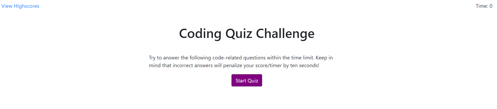
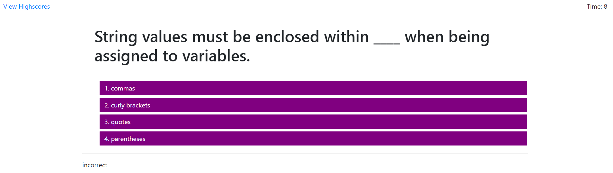
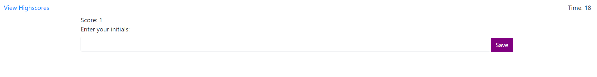
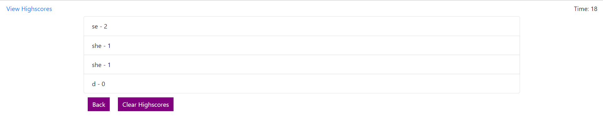

# Selma's HW4 Quiz Timer

## Description: 
In this activity, I am building a quiz which is initated with the click of a button. Then I iterate through the questions and answer choices. The user will then be alerted whether their answer is correct or incorrect. I utilized a timer to keep track of time during this quiz (60 seconds) and added 10 second penalties for incorrect answers. Every correct answer earns you 1 point, and every incorrect answer earns you 0 points. At the end the user will be prompted to enter their intials to get placed on a numerically descending ordered high scores scoreboard. I have also spliced the high scoreboard to only show a maximum of 10 entries so it doesn't get too long. Once the user enters their score, they will be prompted to go back to render the start screen or clear the highscores. If the user does not enter any initials, they will be warned that they need to do so.

I can imagine this real world quiz scenario happens during password security question scenarios to verify that you have correctly answered to pass on to the next step.

## A couple of things I learned in this:
* I challenged myself in this homework by not writing anything in HTML. I created all my elements, text content, classes, etc in my JavaScript file.
* event.preventDefault(); is pretty freaking important.
* I learned how to use key and value pairs to address each prompt, it's answer choices, and the correct answer.
* Learned timers, and needed to clear time intervals for some buttons to make sure time wouldn't keep running.
* .style = "display: none;"; to take away the display in conjunction with a timer.
* Utilized Local Sorage.     
* I could not get the last quiz question to display the 'correct' or 'incorrect' under the question. It carried over into the entry of the initials screen.

## Installation:
* If you need to pull my code for this homework, please visit my Github repository at: https://github.com/selma-e/hw4_quiz_score_board
* If you want to see the final webpage for my code, please visit my hosted website at: https://selma-e.github.io/hw4_quiz_score_board/

## Usage: 

## Resources Used/Credits:

* https://getbootstrap.com/docs/4.5/getting-started/introduction/
* https://developer.mozilla.org/en-US/docs/Web/API/Window/localStorage
* https://www.w3schools.com/js/js_timing.asp
* https://www.w3schools.com/js/js_htmldom_eventlistener.asp

© 2020 Selma Elgabalawy | UW-SEA-FSF-PT-08-2020-U-C-TTh